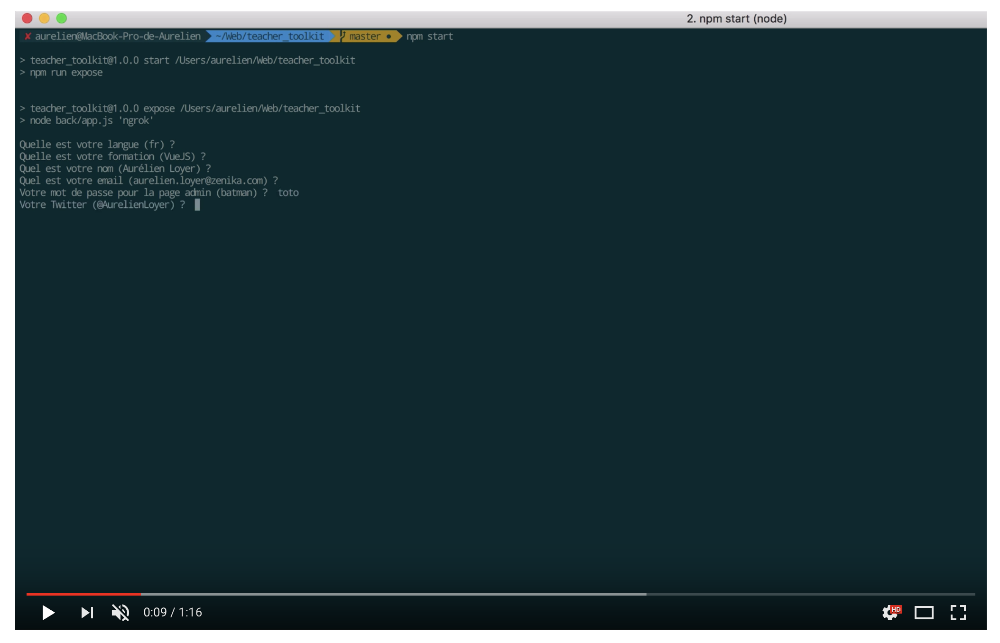
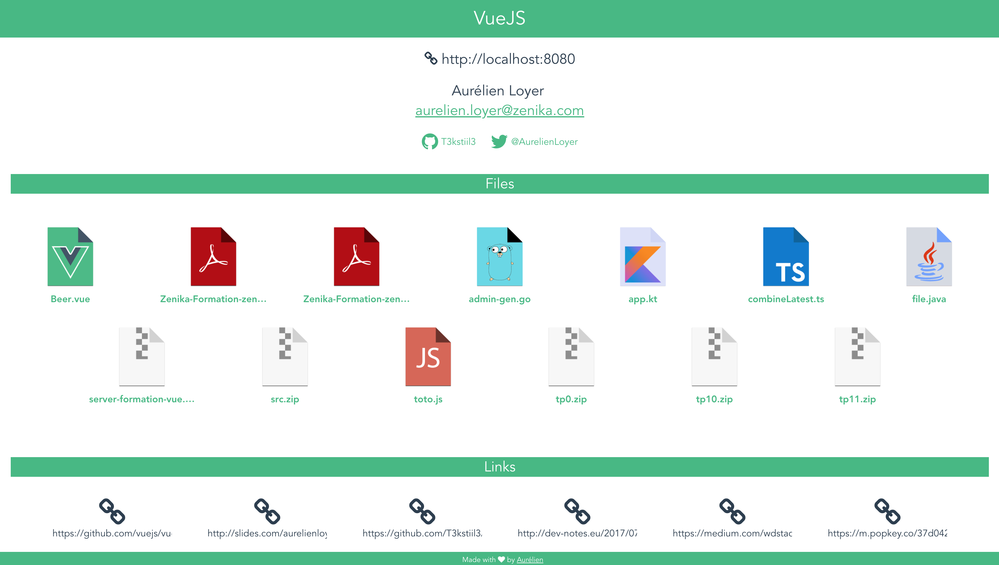
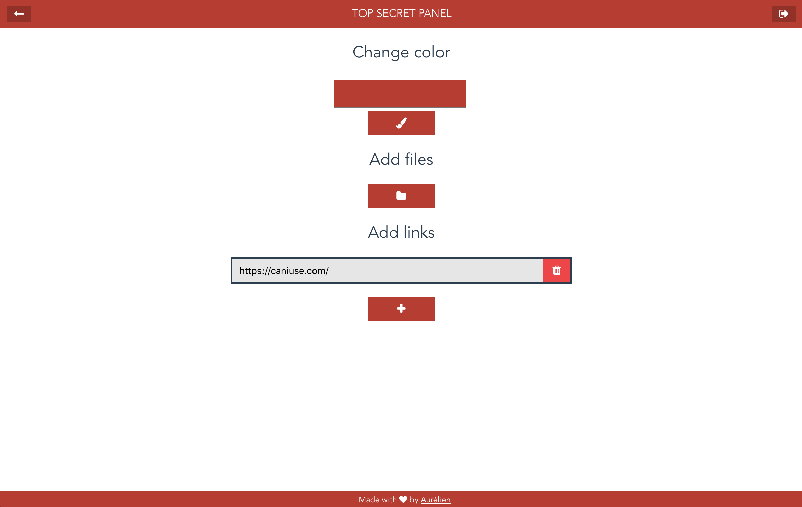

# Teacher Toolkit

Simple files/links share using Node.js / VueJS / Ngrok :+1:

## How to use

- Edit or not config.js file
- Run ```npm start```
- Drop files into files directory
- Change app color
- Add new links
- Enjoy 🦄

## Preview

### Youtube video preview 🎬
<a href="https://www.youtube.com/watch?v=SXe2fv5wMys" target="_blank">



</a>

### User screen


### Admin screen


