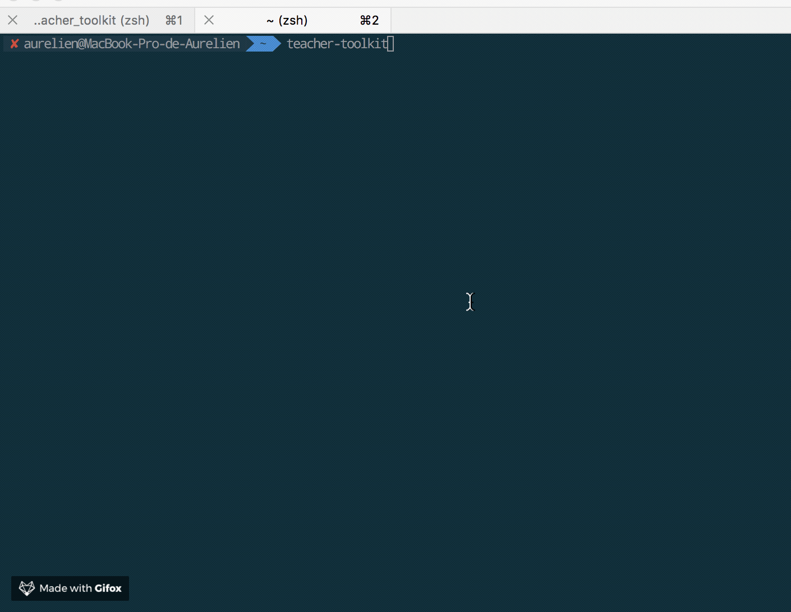
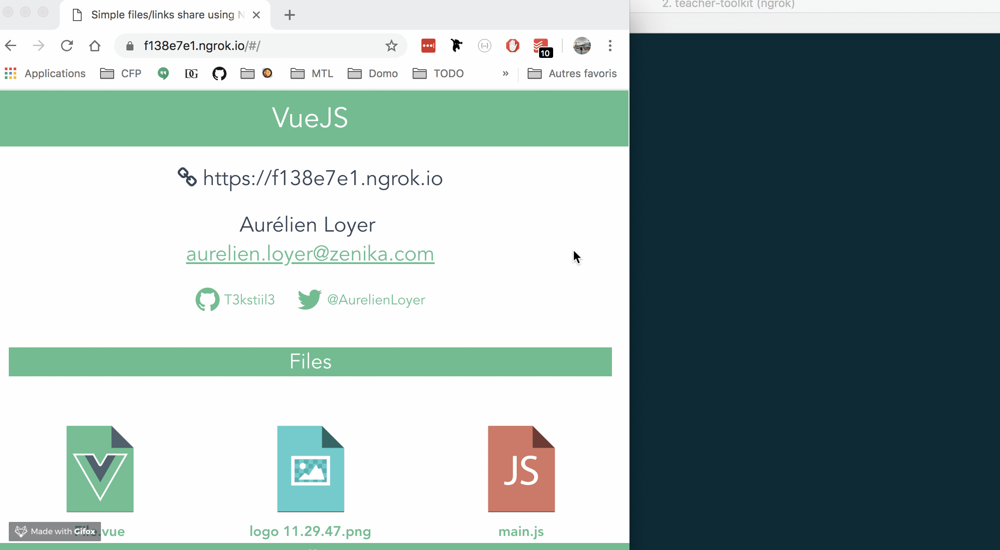
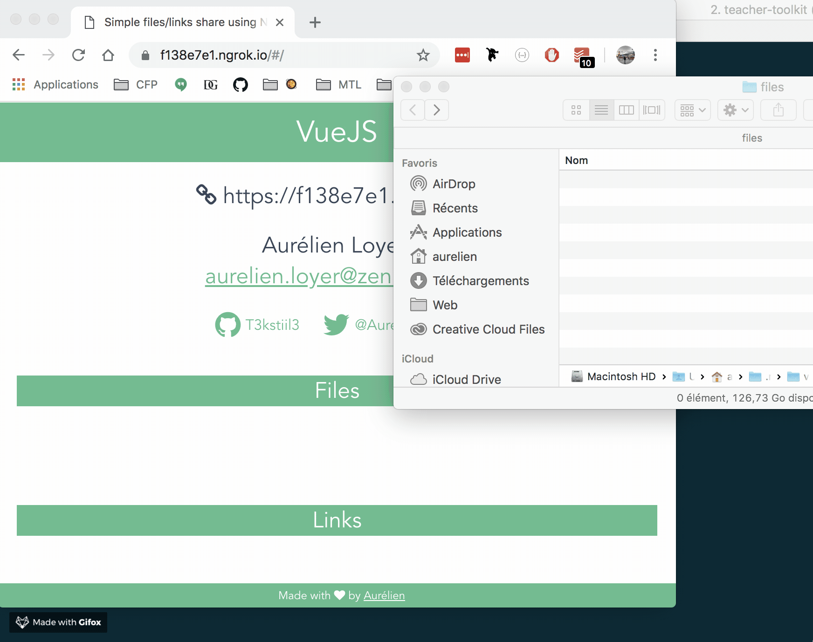
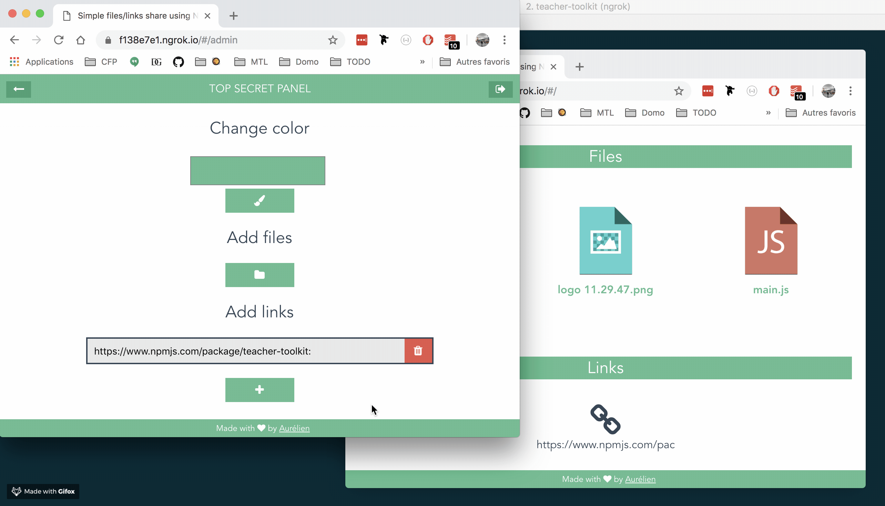

# Teacher Toolkit   

Simple files, links share using Node.js / Vue.js / Ngrok 👍

## How to use

### Global

`npm install -g teacher-toolkit`

### Local

`git clone https://github.com/T3kstiil3/teacher-toolkit.git`

- Edit or not config.js file
- Run `npm install`
- Run `npm start`
- Drop files into files directory
- Change app color
- Add new links
- Enjoy 🦄

## How to enjoy

> 1 - Start App

> 2 - Open directory

> 3 - Add files

> 4 - Share links

## Preview

### Youtube video preview 🎬

### User screen

### Admin screen

